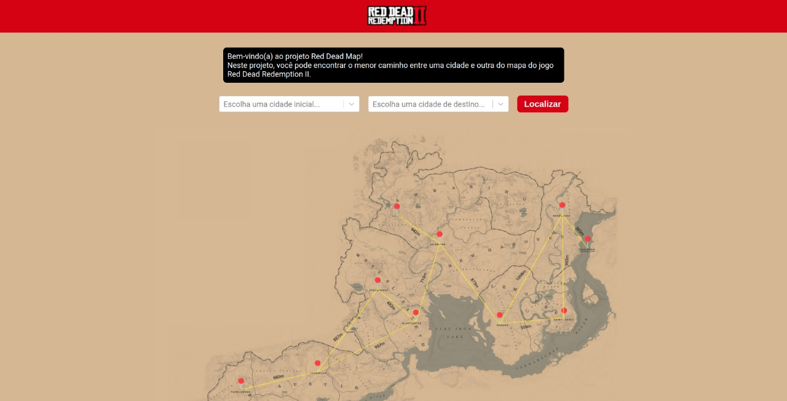
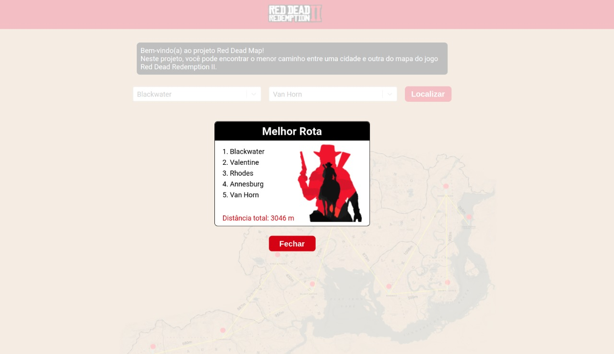

# Red Dead Map


**Número da Lista**: 2<br>
**Conteúdo da Disciplina**: Grafos 2<br>

## Alunos
|Matrícula | Aluno |
| -- | -- |
| 18/0106821  |  Mateus Gomes do Nascimento |
| 18/0132245  |  Vinicius de Sousa Saturnino |

## Sobre

Projeto de Grafos 2 para mostrar a menor rota entre as cidades do jogo Red Dead Redemption II, utilizando grafo, BFS e busca por pesos. Essa é uma evolução do projeto de Grafos 1.

## Apresentação

A apresentação do projeto pode ser vista no seguinte [link](https://youtu.be/MX91DB4iMIU).

## Screenshots

<figcaption>Imagem 1: Mapa do Jogo</figcaption>


<figcaption>Imagem 2: Tela inicial</figcaption>



<figcaption>Imagem 3: Modal de resultado</figcaption>



## Demo

<figcaption>Vídeo 1: Demonstração do projeto


## Instalação 
**Linguagem**: python (back-end) & javascript (front-end)<br>
**Framework**: flask & react js<br>

Um dos pré requisitos para rodar o projeto é ter o `docker` e o `docker-compose` instalados. Outro pré-requisito é ter o `python` versão 3+.

Para subir o docker basta rodar o camando na raíz do projeto:

```shell
$ docker-compose up --build
```

Uma segunda alternativa (caso não possua o `docker` e o `docker-compose` instalados ou não queira perder tempo instalando) é rodar o script `main.py` em `api.main.py` com o comando:

```shell
$ python3 api/main.py
```

para subir o frontend basta executar os comandos dentro da pasta frontend:

```shell
$ yarn
```
e

```shell
$ yarn start
```

E acessar o endereço `http://localhost:3000` no seu navegador.

## Uso 

O mapa do Game estará mostrado com as rotas e ligações entre as cidades. Basta escolher a cidade de origem e a cidade de destino para que a API retorne o caminho mais otimizado a ser percorrido com a menor distância em metros.
